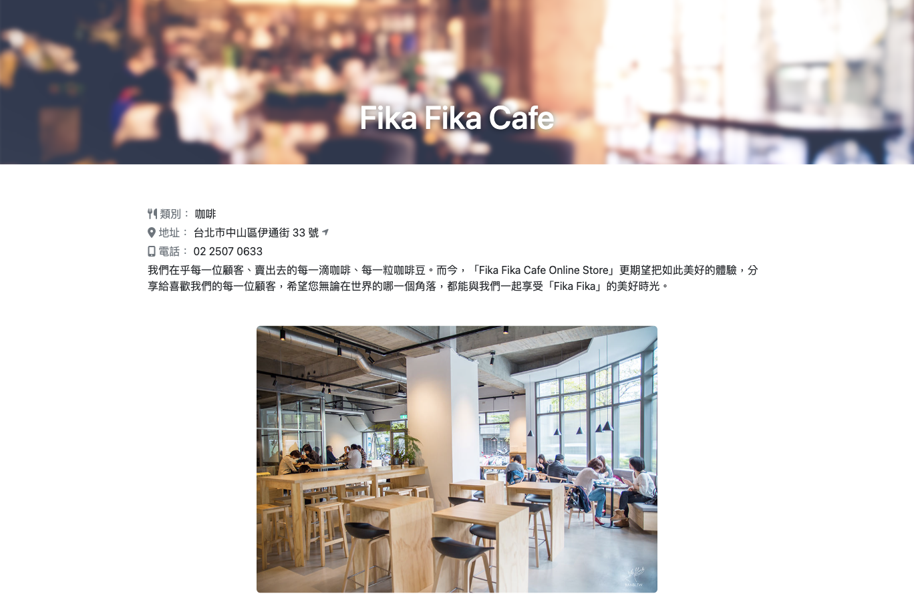

# ALPHA Camp - The restaurant-list project

This is a exercise to set up a express server and use express-handlebars to render the page.

- Screenshot:
  
  
  

## Table of contents

- [Features](#features)
- [Built with](#built-with)
- [Installation and execution](#installation-and-execution)
- [Author](#author)
- [Acknowledgments](#acknowledgments)

## Features

Users should be able to:

- See all restaurants list
- See the detail about the restaurant
- Use keyword to search restaurant name or category

## Built with

- node.js
- express.js
- express-handlebars
- Bootstrap
- Font awesome

## Installation and execution

- Install express & express-handlebars

```Shell
npm i express express-handlebars
```

- Install nodemon

```Shell
npm install -g nodemon
```

- Run the app.js

```Shell
npm run dev
```

## Author

- ALPHA Camp
- YAL

## Acknowledgments

- ALPHA Camp
- Dr. Angela
- goole :D
